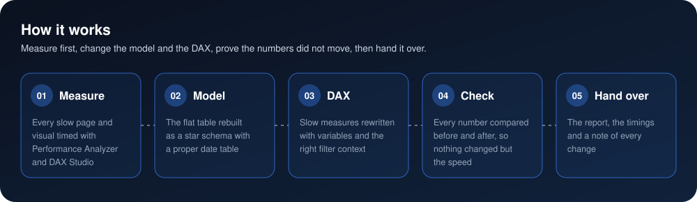
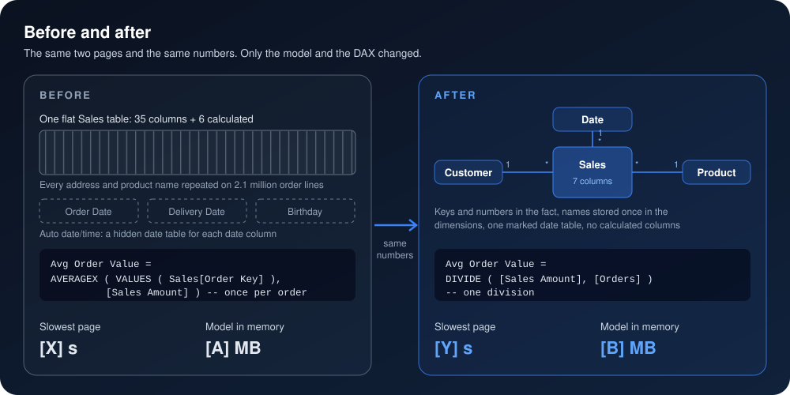
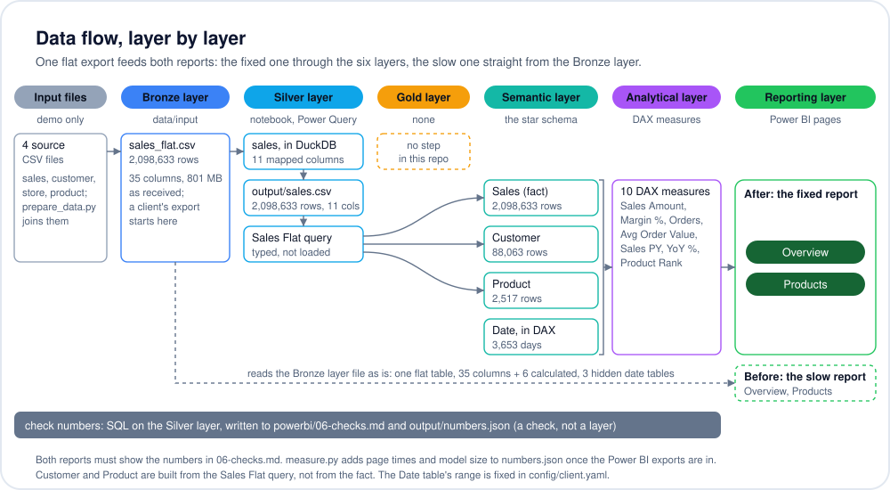
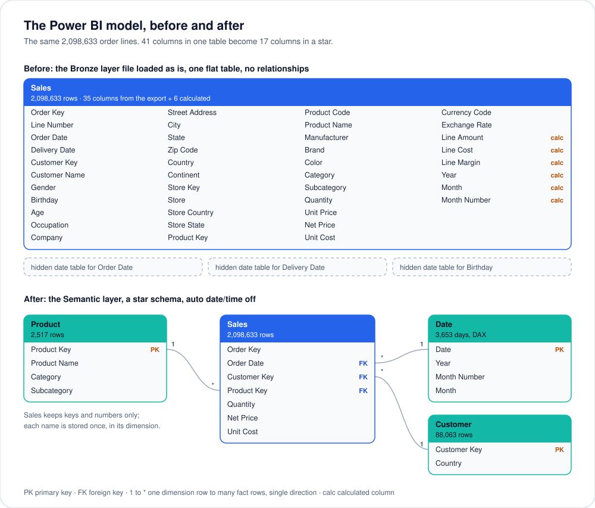

<p align="center">
  
</p>

<p align="center">
  
</p>

<p align="center">
  
  
  
</p>

> 📖 **New to data?** [The project explained, from zero](docs/explained.md): every word, every number and the interview questions, in plain words.

<h3 align="center"><!--n:headline-->2,098,633 sales rows: a 35-column flat table rebuilt as a star schema, with the check numbers both reports must match.<!--/n--></h3>

## The problem

The sales report takes ages to open, so people stop using it and go back to Excel. Nobody trusts a number they can't get quickly, and nobody wants to touch a model they can't read.

Slow reports usually get that way for the same reasons: one wide table pulled straight from an export, Power BI's automatic date tables left on, calculated columns for every small sum, and measures that work row by row. The slow report here is built exactly that way on purpose (`powerbi/before/`), on <!--n:rows_million-->2.1 million<!--/n--> order lines, so the fix can be measured.

## 🛠️ The fix

<p align="center">
  
</p>

<p align="center">
  
</p>

- **Model.** The <!--n:flat_columns-->35<!--/n-->-column flat table becomes a star: a Sales fact that keeps only keys and numbers (7 columns), and Customer, Product and Date dimensions around it. Each product name is now stored once, not on every order line. Auto date/time is off, and one marked Date table drives all time logic.
- **DAX.** No calculated columns: amounts are computed inside the measures. `Avg Order Value` is one division instead of a loop over <!--n:orders_check-->159,695<!--/n--> orders in 2023; counts use `DISTINCTCOUNT` instead of building a table to count it; `Sales PY` uses `SAMEPERIODLASTYEAR` on the date table; results that are used twice are kept in variables. All ten measures are in [`powerbi/03-measures.dax`](powerbi/03-measures.dax), next to the slow versions in [`powerbi/before/03-measures.dax`](powerbi/before/03-measures.dax).
- **Check.** Every card, chart and table is compared with numbers computed in SQL straight from the source ([`powerbi/06-checks.md`](powerbi/06-checks.md)). Both reports must show the same numbers, for example <!--n:sales_check-->$318,425,878<!--/n--> of sales in 2023, down <!--n:yoy_check_abs-->28.4%<!--/n--> on 2022, at a <!--n:margin_check-->56.0%<!--/n--> margin.

## 📈 The result

<p align="center">
  
</p>

| | Before | After |
|---|---|---|
| Tables | 1 flat table | 4: a Sales fact with Date, Customer and Product |
| Columns in the model | 41 (35 + 6 calculated) | 17 (Sales 7, Date 4, Product 4, Customer 2) |
| Calculated columns | 6 | 0 |
| Hidden date tables | 3 (auto date/time) | 0 |
| Numbers on the pages | as in [`06-checks.md`](powerbi/06-checks.md) | must match; checked once the reports are built |

<!--n:timings-->

Page load times and model size are measured next, in Power BI Desktop, from a cold cache, with the method in [`docs/measuring.md`](docs/measuring.md). The notebook reads the exports and works out the before and after numbers, and they are written here.

<!--/n-->

## 📸 Screenshots

Added once the reports are built.

## ▶️ Run it

<p align="center">
  
</p>

```bash
pip install -r requirements.txt
python data/demo/prepare_data.py
python config.py
jupyter nbconvert --to notebook --execute --inplace analysis/analysis.ipynb
python theme.py
python data/demo/publish.py
```

1. `data/demo/prepare_data.py` downloads the demo data (<!--n:archive_mb-->42 MB<!--/n-->), unpacks it and writes `data/input/sales_flat.csv` (<!--n:rows_million-->2.1 million<!--/n--> rows, <!--n:flat_mb-->801 MB<!--/n-->), the flat export the slow report reads. A client's export goes there instead ([input guide](data/input/README.md)).
2. `config.py` checks `config/client.yaml` and the export; the notebook computes every check number, writes `output/sales.csv` (what the fixed report reads), `powerbi/06-checks.md` and `output/numbers.json`; `theme.py` writes the Power BI theme from the config; `data/demo/publish.py` (demo only) writes the numbers into this README, the diagrams and the portfolio site's card.
3. Build and time both reports in Power BI Desktop with [`powerbi/08-build-checklist.md`](powerbi/08-build-checklist.md): click by click, with the numbers to check at each step, ending with the timing exports in `data/input/` ([method](docs/measuring.md)). Then rerun the notebook and `data/demo/publish.py`.

## 🏗️ For engineers

Every file the scripts and the notebook read and write, in the six layers: Bronze layer (`data/input/sales_flat.csv`, the export as received), Silver layer (the notebook's 11 mapped columns in `output/sales.csv`, typed by the `Sales Flat` query), Gold layer (no step: the fix adds no business rules), Semantic layer (the star schema), Analytical layer (the ten DAX measures) and Reporting layer (the Overview and Products pages). The slow report reads the Bronze layer file straight into its pages, which is what makes it slow:



The model before and after the fix, with every column. The star schema is the Semantic layer:



## 🗂️ Data

Contoso sales data made with SQLBI's [Contoso Data Generator V2](https://github.com/sql-bi/Contoso-Data-Generator-V2) (the ready-made 1M set, MIT licence): generated, not real, with <!--n:sales_rows-->2,098,633<!--/n--> order lines from <!--n:orders-->875,901<!--/n--> orders between <!--n:first_month-->January 2015<!--/n--> and <!--n:last_month-->April 2024<!--/n-->. `data/demo/prepare_data.py` joins its sales, customer, product and store tables into the one flat export the slow report is built on.

<p align="center">
  
</p>
